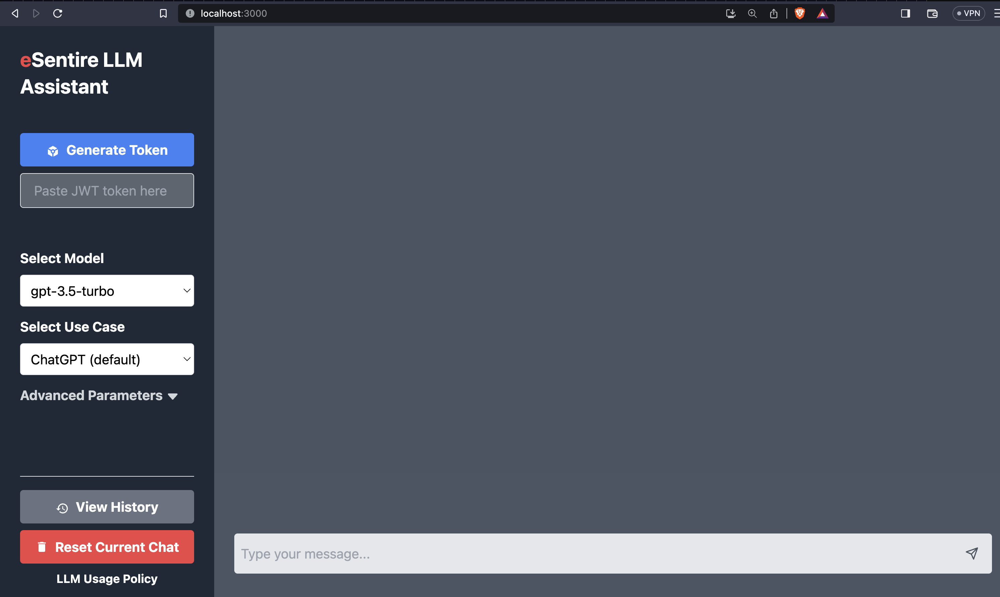

# LLM Gateway

 


  


### Table of Contents  
- [LLM Gateway Framework](#llm-gateway-framework)  
- [How the Data is Stored](#how-the-data-is-stored)  
- [Requirements](#requirements)  
- [Run the app](#run-the-app)  
  - [Full Stack](#full-stack)
  - [Backend Only](#backend-only)
  - [Frontend Only](#frontend-only)

---

## LLM Gateway Framework

As the LLM landscape evolves and increasingly creeps into our lives, businesses will need tools to help monitor and mitigate vulnerabilities these new technologies introduce. 

This repo contains sample code of how other businesses could implement their own LLM Gateway Framework to monitor and manage these risks.

The image below demonstrates an example of how this framework could look.


The numbered references in the image above are mapped to the related files and line numbers (if applicable) in the following table:

| Image Ref # | Relevant Files | Relevant Line Number |
| ------------| -------------- | --------------------|
| (1) | [./frontend/Dockerfile](/frontend/Dockerfile) | N/A |
| (2) | [./backend/Dockerfile](/backend/Dockerfile) | N/A |
| (3) | [./backend/src/modules/chat.py](/backend/src/modules/chat.py) | 104-105 |
| (4) | [./backend/src/modules/chat.py](/backend/src/modules/chat.py) | 107-119 |
| (5) | [./backend/src/modules/chat.py](/backend/src/modules/chat.py) | 82 |
---

## How the data is stored
Read more on how the data is organized and details on the columns at:
- [./backend/tables.sql](/backend/tables.sql), or
- [./backend/modules/auto_models.py](/backend/modules/auto_models.py)

Each time a user makes a call to the [/chat](./backend/src/modules/chat.py) endpoint, a record is saved to a docker postgres database.

The following table demonstrates a sample conversation (a series of calls to the [/chat](./backend/src/modules/chat.py) endpoint):

| id | request | usage_info | user_name | title | response_time | response | convo_title | convo_show | root_gpt_id |
| -- | ------- | -- | -- | -- | -- | -- | -- | -- | -- |
| 1a481b96-c7fd-4526-91b8-57bfb2a255a5 | ```json {"model": "gpt-3.5-turbo", "messages": [{"role": "user", "content": "write me a 1 sentence horror story"}]} ```| {"total_tokens": 33, "prompt_tokens": 16, "completion_tokens": 17} | user | app | 2023-04-27 16:25:48.872857 | {"id": "chatcmpl-79yjFQdeeGuedzKcAbiHg0hlR52b6", "uuid": "1a481b96-c7fd-4526-91b8-57bfb2a255a5", "model": "gpt-3.5-turbo-0301", "usage": {"total_tokens": 33, "prompt_tokens": 16, "completion_tokens": 17}, "object": "chat.completion", "choices": [{"index": 0, "message": {"role": "assistant", "content": "As I reached for the light switch in the darkness, a cold hand grabbed mine."}, "finish_reason": "stop"}], "created": 1682612749, "root_uuid": "1a481b96-c7fd-4526-91b8-57bfb2a255a5"}| A horror story was requested and extended. | true | 1a481b96-c7fd-4526-91b8-57bfb2a255a5 |
| 3f04805a-78e7-4c13-842a-4f777f0dc7a9 | {"model": "gpt-3.5-turbo", "messages": [{"role": "user", "content": "write me a 1 sentence horror story"}, {"role": "assistant", "content": "As I reached for the light switch in the darkness, a cold hand grabbed mine."}, {"role": "user", "content": "add another sentence to the story"}]} | {"total_tokens": 71, "prompt_tokens": 49, "completion_tokens": 22} | user | app | 2023-04-27 16:28:01.604278 | {"id": "chatcmpl-79ylN0uGSnY8aPMgMRgPJB4cjba5p", "uuid": "3f04805a-78e7-4c13-842a-4f777f0dc7a9", "model": "gpt-3.5-turbo-0301", "usage": {"total_tokens": 71, "prompt_tokens": 49, "completion_tokens": 22}, "object": "chat.completion", "choices": [{"index": 0, "message": {"role": "assistant", "content": "I turned around but no one was there, just a feeling of icy breath on the back of my neck."}, "finish_reason": "stop"}], "created": 1682612881, "root_uuid": "1a481b96-c7fd-4526-91b8-57bfb2a255a5"} | A horror story was requested and extended. | true | 1a481b96-c7fd-4526-91b8-57bfb2a255a5


The LLM interactions here are based off of calling the OpenAI [chat completions](https://platform.openai.com/docs/guides/gpt/chat-completions-api) endpoint. 

Each subsequent call to the [/chat](./backend/src/modules/chat.py) endpoint in a single conversation is appended to an array containing a history of the original prompt, prior requests, and prior responses. You can see this in the above table by how the second request item is built off of the first request item. 

This results in the same conversation being recorded over and over but with additional requests and responses with each row. 

To help identify rows that are part of the same conversation, therefore historical snapshots of the same conversation, filter out database results based on the root_gpt_id. In this example, we see that the two records are snapshots of the same conversation because they share the same root_gpt_id ```1a481b96-c7fd-4526-91b8-57bfb2a255a5```, which is the original id of the first interaction of this conversation.

---

## Requirements
In order to deploy successfully with docker-compose, please make sure you have ```docker-compose version 1.29.2``` installed.

---

## Run the App
The code included in this repo includes both a client chat app and a backend api. Follow the instructions below to configure and run whichever you prefer.

### Full Stack
1. Customize the following api environment variables (lines 17-21)  at the [docker-compose.yml](docker-compose.yml) at the root of this repo  
  a. LLM_ENDPOINT  
  b. LLM_IMG_ENDPOINT  
  c. LLM_API_AUTHORIZATION  
  d. ENABLE_SUBMISSIONS_API  
  e. SUBMISSIONS_API_URL  
  f. <ins>**If using in production**</ins>, modify all endpoints with user details using whichever method you use to manage IAM to the endpoints. The goal is to ensure you track users and filter user data where necessary. See endpoints at [./backend/src/modules/chat.py](/backend/src/modules/chat.py)
2. Run the app with ```docker-compose up -d --build```  
(If you alter the [database](/backend/tables.sql) and [python classes](/backend/src/modules/auto_models.py), make sure to remove the volumne so the database is recreated.)with ```docker volume rm  public-llm-gateway-stack_postgres_data```
3. See the running app:  
    - Swagger docs are available locally at: ```http://localhost:8008/docs```
    - The chat app or LLM Assistant is available at: ```http://localhost:3000```
4. Log into psql database container (make sure you're still in the root directory): ```docker-compose exec db psql --username=fastapi_traefik --dbname=fastapi_traefik```

5. Connect to a database: ```\c ```
6. See all schemas: ``` \dn ```
7. Select all rows in llm_logs schema: ```select * from llm_logs.chatgpt_logs;```
8. Quit psql: ``` \q ```
9. Take down the docker-compose: ``` docker-compose down ```

## Backend Only
1. Customize the following api environment variables (lines 17-21) at in [./backend/docker-compose.yml](/backend/docker-compose.yml). (Notice that this is a different docker-compose file compared to the fullstack one above.)
  a. LLM_ENDPOINT  
  b. LLM_IMG_ENDPOINT  
  c. LLM_API_AUTHORIZATION  
  d. ENABLE_SUBMISSIONS_API  
  e. SUBMISSIONS_API_URL  
  f. <ins>**If using in production**</ins>, modify all endpoints with user details using whichever method you use to manage IAM to the endpoints. The goal is to ensure you track users and filter user data where necessary. See endpoints at [./backend/src/modules/chat.py](/backend/src/modules/chat.py)
2. Repeat steps 2-9, except the chat app will not be available


## Frontend Only
### Overview
The frontend app uses an express server to serve the pre-built static files of a react app.
The server is located at [./frontend/src/deployment_server/server.js](/frontend/src/deployment_server/server.js).

The react app is located at [./frontend/src/src/App.js](/frontend/src/src/App.js)

Only run the front end only if you have another llm gateway proxy configured already. Otherwise, the chat app will be pointing at a non-existent proxy url and will not work.

Alternately, you could configure LLM_GATEWAY_URL to point to an existing public LLM endpoint, such as ```https://api.openai.com/v1/chat/completions```, then uncomment the token fields in the UI and allow users to pass public LLM tokens directly through the UI. 

### Chat client Features
- Pass an API token directly from the UI: "Paste Token Here" user input box-- See config details below
- See historical conversations with the "History" button
- Customize LLM parameters such as temperature

### Instructions to run

1. Customize the following api environment variables [./frontend/docker-compose.yml](/frontend/docker-compose.yml):
  a. LLM_GATEWAY_URL
2. React code to customize:
  a. [./frontend/src/src/App.js](/frontend/src/src/App.js): Modify the /checkchat endpoint to pass user details, if you use this too
  b. If you wish to enable the "Paste token here" input box, modify  [./frontend/src/src/components/Sidebar.js](/frontend/src/src/components/Sidebar.js)-- set ```disabled``` to false
  c. If you wish to configure the "Generate Token" button, modify the URL set in [./frontend/src/src/components/Sidebar.js](/frontend/src/src/components/Sidebar.js)
  d. If you wish to have a customized "history" display for different users, make sure to customize the ```/history_v2``` endpoint in [./frontend/src/src/components/Sidebar.js](/frontend/src/src/components/Sidebar.js) and in the backend to receive user details to filter on.
  e. If your company has an LLM usage policy, link it by modifying the href value on [./frontend/src/src/components/Sidebar.js](/frontend/src/src/components/Sidebar.js)
3. Run the app with ```docker-compose up -d --build```  
4. Take down the docker-compose: ``` docker-compose down ```
---

### Configure the Full Stack gateway and client to hit an Amazon Sagemaker Endpoint, exposed through AWS API
See [./tutorials/sagemaker/README.md](/tutorials/sagemaker/README.md)

---
## Load a Sample Power BI Report


The data generated by the LLM Gateway can generate interesting reports. A sample user usage report is included with this repo.

The attached power bi report in [./example-powerbi-report/llm-logs-demo.pbix](/example-powerbi-report/llm-logs-demo.pbix).

### Requirements
- PowerBI Desktop App
- Run the [Full Stack](#full-stack) or [Backend Only](#backend-only) docker containers, following the instructions above; The power bi pbix file is configured to connect to the postgres docker container created when running the backend code
- psql client for your computer or whatever tool you use to access the postgres database

### Instructions to view the power report
1. Run this repo following the [Full Stack](#full-stack) or [Backend Only](#backend-only) instructions
2. Connect to the postgres docker container
```
psql -h 127.0.0.1 -p 5432 -U fastapi_traefik
```
3. Copy and paste the sql insert statements in [./example-powerbi-report/llm-logs-demo-logs.sql](/example-powerbi-report/llm-logs-demo-logs.sql) and run in the psql client.
4. When the inserts are done, go to your powerbi desktop app, and import the pbix file at [./example-powerbi-report/llm-logs-demo.pbix](/example-powerbi-report/llm-logs-demo.pbix)
