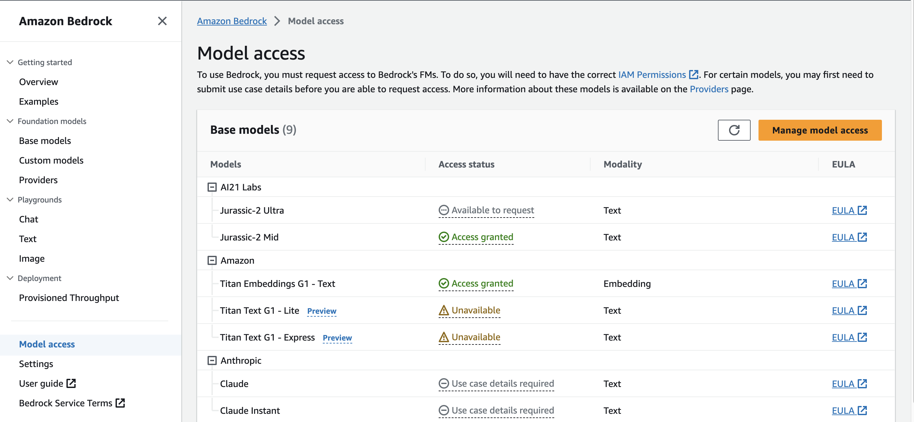
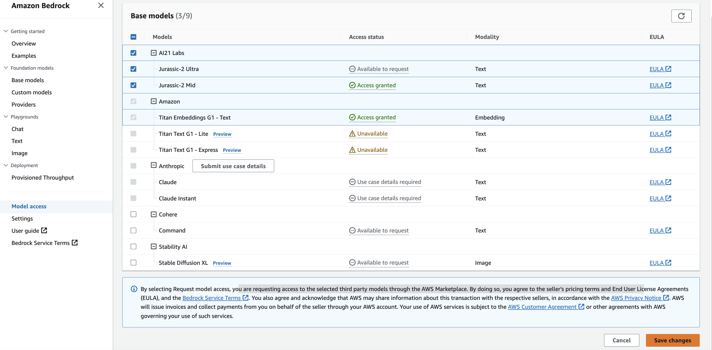

## Set Up a local instance of the Full Stack LLM Gateway with AWS Bedrock 

### AWS Prerequisites

The following tutorial walks you through configuring the LLM-Gateway with an AWS Bedrock endpoint.

In order to successfully follow the tutorial, ensure that you have AWS cli installed so that you may programmatically authenticate to your aws account. Additional Details here: https://docs.aws.amazon.com/cli/latest/userguide/getting-started-prereqs.html


### AWS Configuration
1.  First, request access to which ever model you wish to interact with. (Additional Instructions are available here: https://docs.aws.amazon.com/bedrock/latest/userguide/model-access.html).

Since each foundation model has varied schema inputs, to reduce possible schema validations errors while following this tutorial, please enable access to model ID ```ai21.j2-mid-v1``` or the ```A21 Labs Jurassic-2 Mid``` Foundation Model. 

- See details on all model IDs here: https://docs.aws.amazon.com/bedrock/latest/userguide/model-ids-arns.html
- See examples of the parameters available for each models here: https://docs.aws.amazon.com/bedrock/latest/userguide/model-parameters.html

    a. Go to AWS Console -> Bedrock -> Model access -> Select the "Manage model access" button
    

    
    b.  Check the models you wish access to -> Select "Save changes" 
    
    ** Take note of the pricing and End User License Agreements you agree to in order to access the models.
    

2. Now configure an IAM role that your llm-gateway-api docker container may assume to call the Bedrock APIs. 
___

:bulb: Using AWS ecs-local-endpoints

In order to simplify authentication access the bedrock api from your local machine, this repo uses the [awslabs/amazon-ecs-local-container-endpoints](https://github.com/awslabs/amazon-ecs-local-container-endpoints) docker-componse.override.yml file.

Learn more here: https://nathanpeck.com/testing-containers-locally-amazon-ecs-local-docker-compose/

We will review configuration changes to the docker-compose.override.yml file shortly.
___

    a. Create a new policy. To keep things simple, this policy grants access to all bedrock apis and to all bedrock resources:


    ```json
    {
        "Version": "2012-10-17",
        "Statement": [
            {
                "Effect": "Allow",
                "Action": "bedrock:*",
                "Resource": "*"
            }
        ]
    } 
    ```

    b. Create a role with the newly created policy.

    c. Create a trust relationship 

    Make sure to modify the Pricipal to the role you intend to use to assume this role.

    ```json
    {
        "Version": "2012-10-17",
        "Statement": [
            {
                "Sid": "stsTrust",
                "Effect": "Allow",
                "Principal": {
                    "AWS": "arn:aws:sts::{AccountID}:assumed-role/{RoleName}/{RoleSessionName}"
                },
                "Action": "sts:AssumeRole"
            }
        ]
    }
    ```

### LLM Gateway Configuration
1. Configure the following environment variables in the ```docker-compose.yml```

Note that each environment varible is follwed with either "api" or "frontend" service. This indicates the specific docker service definition where the environment variable is located. (There are three services defined: api, db, and frontend.)

| Environment Variable | Value |
| -------------------- | ----- |
| LLM_TYPE (api service) | Make sure this array includes BEDROCK to enable bedrock backend apis. For example, [BEDROCK] if you only wish to enable bedrock api services, or [OPEN_AI, BEDROCK] to enable both Open AI and Bedrock | 
| BEDROCK_ASSUMED_ROLE (api service)  | Provide the ARN of the role to assume to access bedrock APIs |
| AWS_REGION (api service) | The AWS Region in which the service should be called (e.g. "us-east-1"). |
| MODEL_ID (api service) | Populate this with the bedrock model id used. By default it is set to "ai21.j2-mid-v1" because that is the model used in this tutorial. |
| LLM_TYPE (frontend service) | Make sure this is set to "BEDROCK" to enable the frontend chat client to make calls to the BEDROCK api backend. |
| BEDROCK_MODEL_ID (frontend service | This field is also set to "ai21.j2-mid-v1" by default because it is the model used in this tutorial. If you modify the model id, you will likely need to modify both frontend and backend code to correctly structure and parse your api body. |

:star: Notes
This example of a bedrock generative llm exchange does not retain context of prior messages unlike the sagemaker and openai chats.

However, you could modify the code to leverage Langchain to retain context of the prior messages. An example of this is available at this repo: https://github.com/aws-samples/amazon-bedrock-workshop/blob/main/04_Chatbot/00_Chatbot_AI21.ipynb 