## Configure the Full Stack LLM Gateway & client with AWS Sagemaker (Llama-2-7b) Endpoint

### AWS Configuration
Follow the steps below to quickly setup an LLM endpoint in AWS. This is an example POC and by no means production ready. Make sure to secure your resources appropriately!

If you already have an endpoint and just need guidance on modifying the LLM-Gatway, go to [LLM Gateway Configuration](#llm-gateway-configuration)  

#### Configure Sagemaker Endpoint

1. Go to Sagemaker in the aws console and set up a domain.

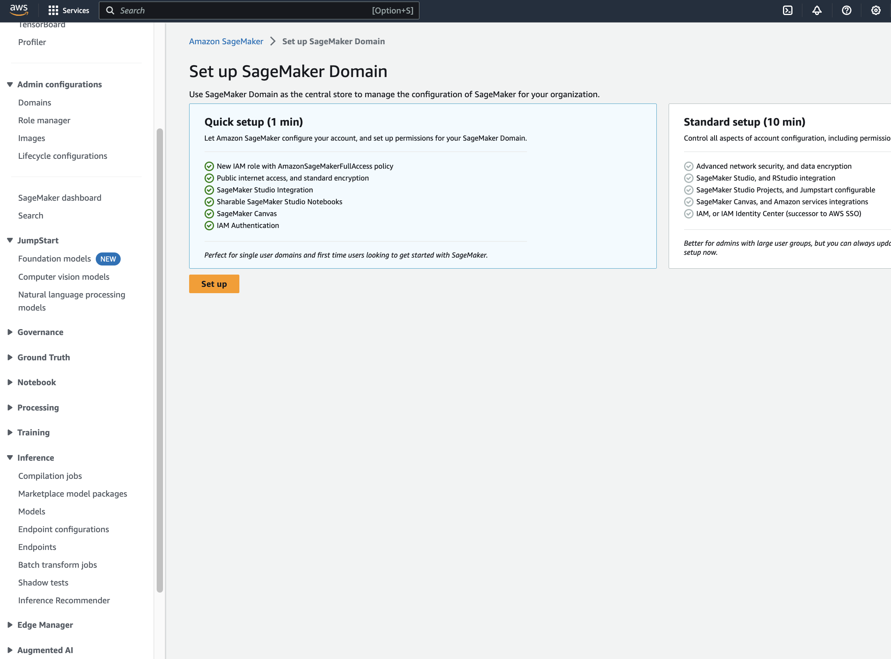 


2. Select a model from Sagemaker Studio Jumpstart.

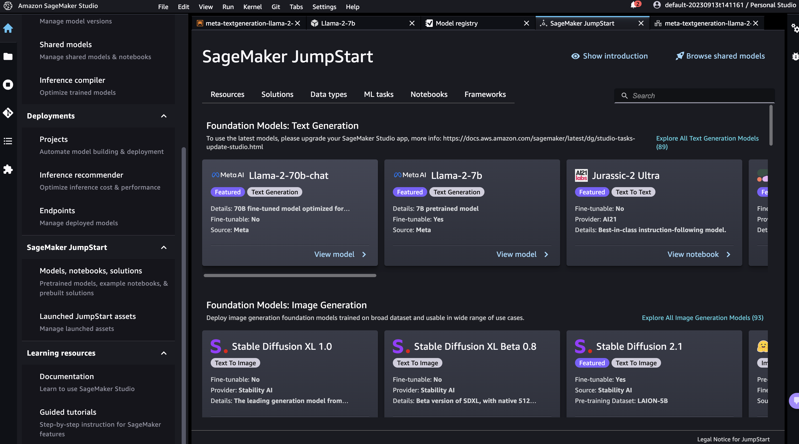

3. Deploy your model, accepting the terms of use. 

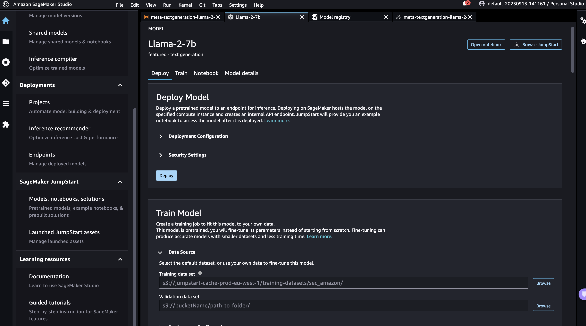 


4. Once the model is deployed, look for the ```Deployments``` -> ```Endpoints``` tab on the left menu bar. Look for the endpoint you just deployed and save the name for later.

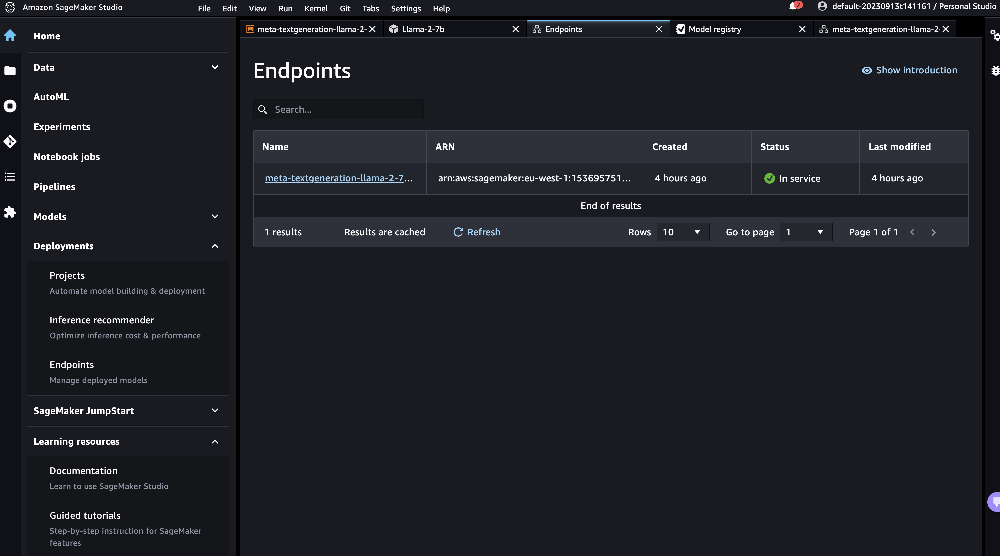 


#### Configure AWS Lambda

1. Create a new lambda function. 
Select following paramters:
    - python 3.11 (latest as of writing this file)
    - which ever architecture you prefer, I used x86_64
    - Execution Role: Create a new role with basic Lambda permissions

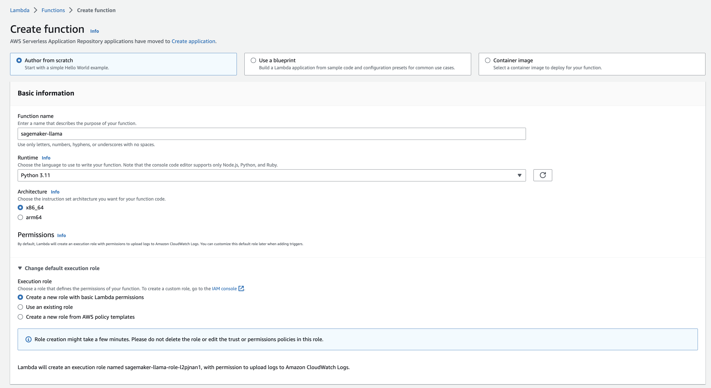 

2. Configure the newly created lambda role:
Go to ```Configuration```->```Permissions```. 
Select the link to go to your lambda execution role.


3. Modify the role, adding an inline permission allowing it to invoke the sagemaker endpoint.

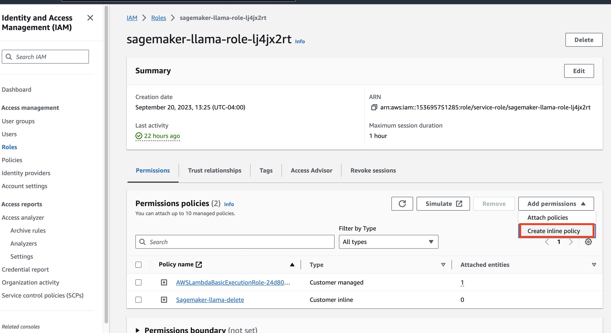 

```json
{
	"Version": "2012-10-17",
	"Statement": [
		{
			"Sid": "VisualEditor0",
			"Effect": "Allow",
			"Action": "sagemaker:InvokeEndpoint",
			"Resource": "*"
		}
	]
}
```

4. Update your lambda_function.py code with the following:

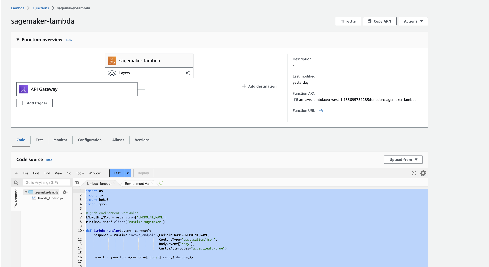 

```python
import os
import io
import boto3
import json

# grab environment variables
ENDPOINT_NAME = os.environ['ENDPOINT_NAME']
runtime= boto3.client('runtime.sagemaker')

def lambda_handler(event, context):
    response = runtime.invoke_endpoint(EndpointName=ENDPOINT_NAME,
                                       ContentType='application/json',
                                       Body=event['body'],
                                       CustomAttributes="accept_eula=true")
    
    result = json.loads(response['Body'].read().decode())
    
    
    return {
        "statusCode": 200,
        "body": json.dumps(result)
    }
```

5. Add the an environment variable "ENDPOINT_NAME" with a value of the endpoint name saved in step 4 of [Configure Sagemaker Endpoint](#configure-sagemaker-endpoint):

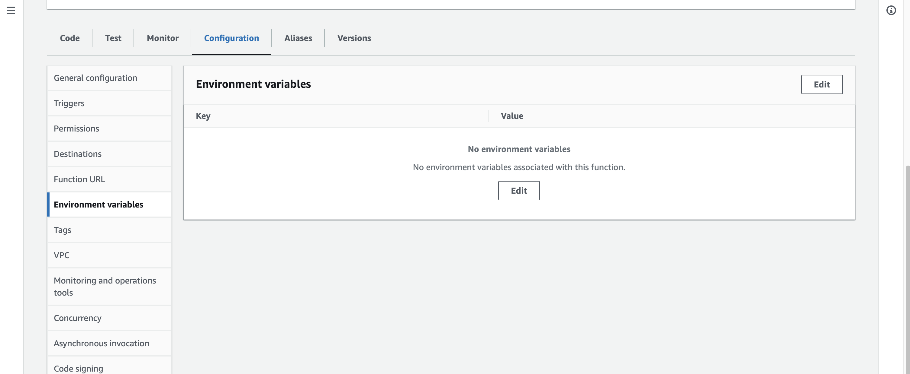 

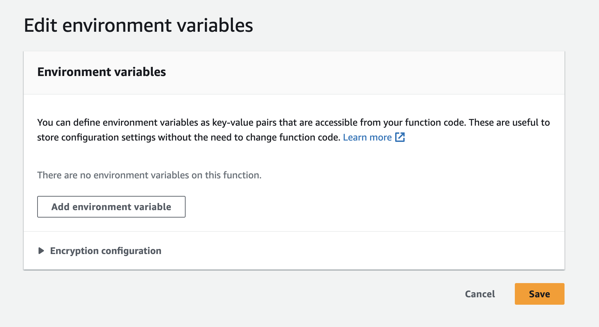 

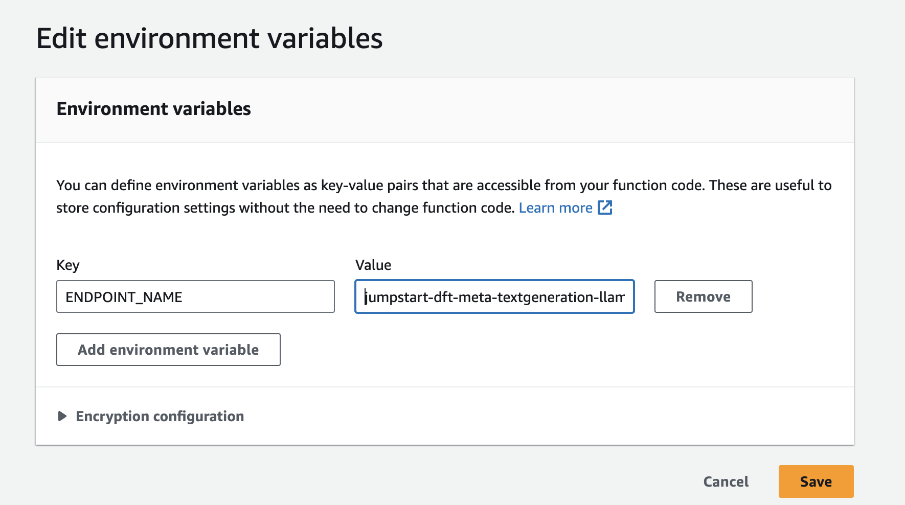 

6. Add an AWS API Gateway as a lambda trigger. Select the following configuration parameters:
    - Create a new API
    - HTTP API
    - Open (However, make sure to secure your APIs before deploying to prod)

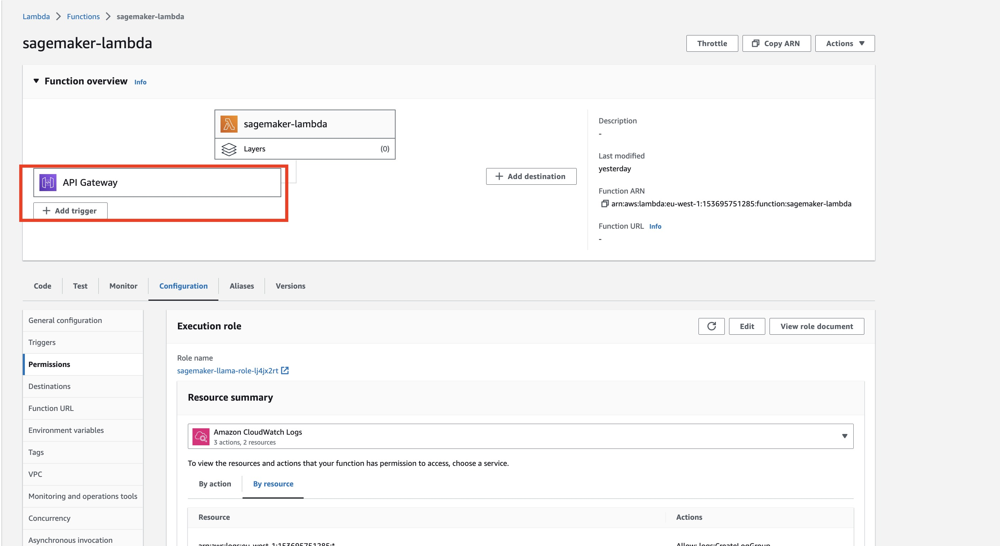 

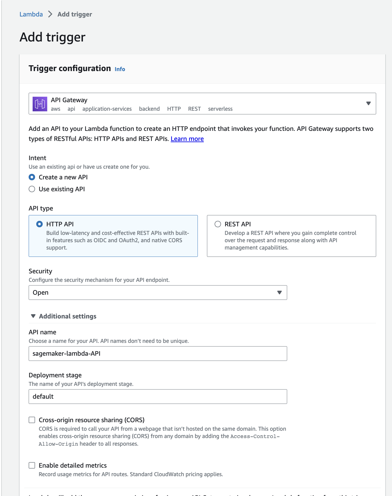 

7. AWS API gateway times out after 29 seconds (https://docs.aws.amazon.com/apigateway/latest/developerguide/limits.html). To maximize the time the lambda and api gateway allocate sagemaker to respond, modify the lambda timeout field to 30 seconds, under ```General configuration```->```Edit``` -> ```Timeout```. 

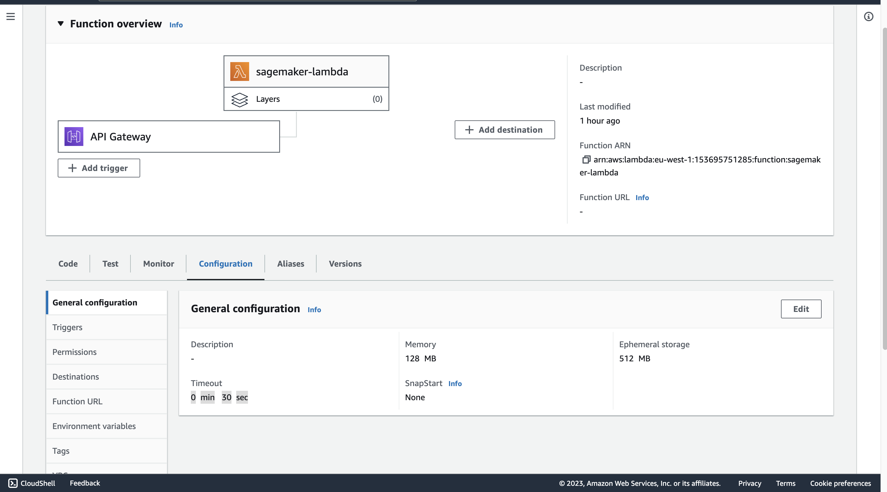 

8. Retrieve your API url by going to ```configuration``` -> ```trigger ```

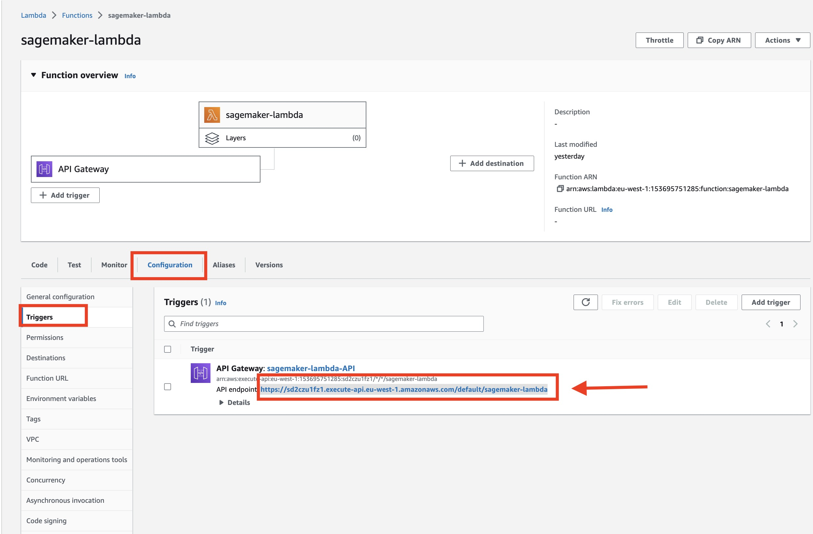

9. Test your API Gateway by calling the API endpoint with the following request body:

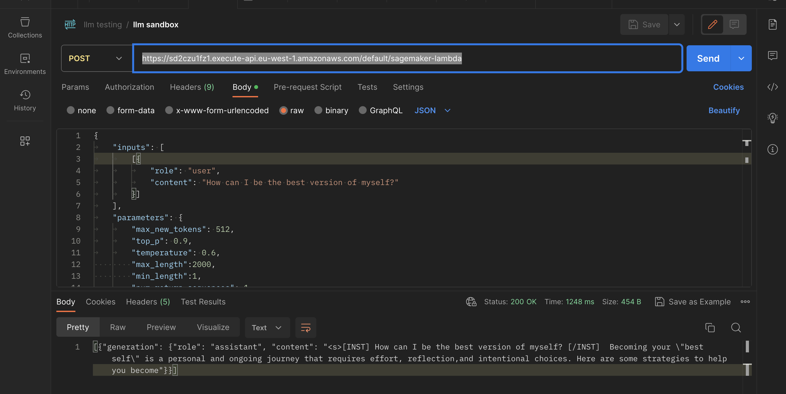 

```json
{
	"inputs": [
		[{
			"role": "user",
			"content": "How can I be the best version of myself?"
		}]
	],
	"parameters": {
		"max_new_tokens": 512,
		"top_p": 0.9,
		"temperature": 0.6
	}
}
```


### LLM Gateway Configuration
Ok, great. Now that we know we have a working API to the sagemaker llm, we need to modify our code so we can send and parse the http requests correctly.

Remember, this is just a quick proof of concept to get you running, and requires much more work before it's ready for a production product.

1. Take each of the code files in ```tutorials/sagemaker/backend``` and ```tutorials/sagemaker/frontend```, and replace the corresponding files in the respective ```backend/``` and ```frontend/``` folders.

Specifically, make sure to copy and replace the following:

| Replace this file | With this sagemaker modified codebase |
|-------------------|---------------------------------------|
|[./frontend/src/src/components/Sidebar.js](/frontend/src/src/components/Sidebar.js)|[./tutorials/sagemaker/frontend/src/src/components/Sidebar.js](/tutorials/sagemaker/frontend/src/src/components/Sidebar.js)|
|[./frontend/src/src/App.js](/frontend/src/src/App.js)|[./tutorials/sagemaker/frontend/src/src/App.js](/tutorials/sagemaker/frontend/src/src/App.js)|
|[./backend/src/modules/chat.py](/backend/src/modules/chat.py)|[./tutorials/sagemaker/backend/src/modules/chat.py](/tutorials/sagemaker/backend/src/modules/chat.py)|
|[./backend/src/modules/classes.py](/backend/src/modules/classes.py)|[./tutorials/sagemaker/backend/src/modules/classes.py](/tutorials/sagemaker/backend/src/modules/classes.py)|
|[./docker-compose.yml](/docker-compose.yml)|[./tutorials/sagemaker/docker-compose.yml](/docker-compose.yml)|

And voila! Now follow the ```Full Stack``` instructions in [./README.md](/README.md) to kick up the llm client.

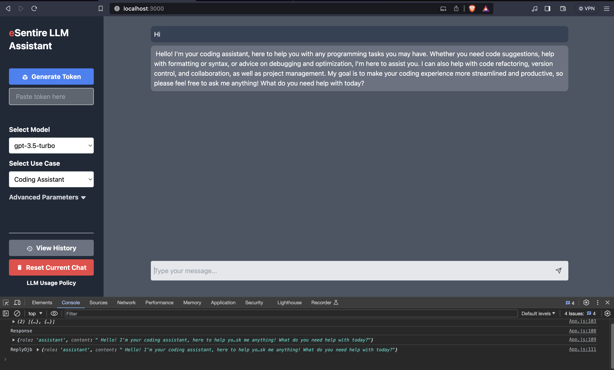 

### Debugging AWS API
If the API call isn't working, and you have no idea why, try following these instructions to figure out why:

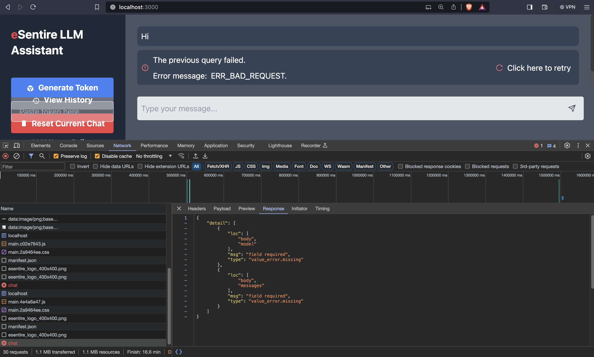 

1. Go to ```Cloudwatch```->```log groups```.
2. Find the log group for your sagemaker endpoint. It should follow a naming convention of ```aws/sagemaker/Endpoints/[endpoint name]```
3. Check it out!

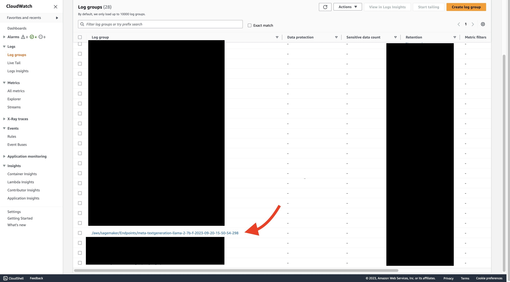 